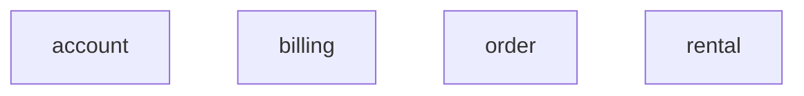
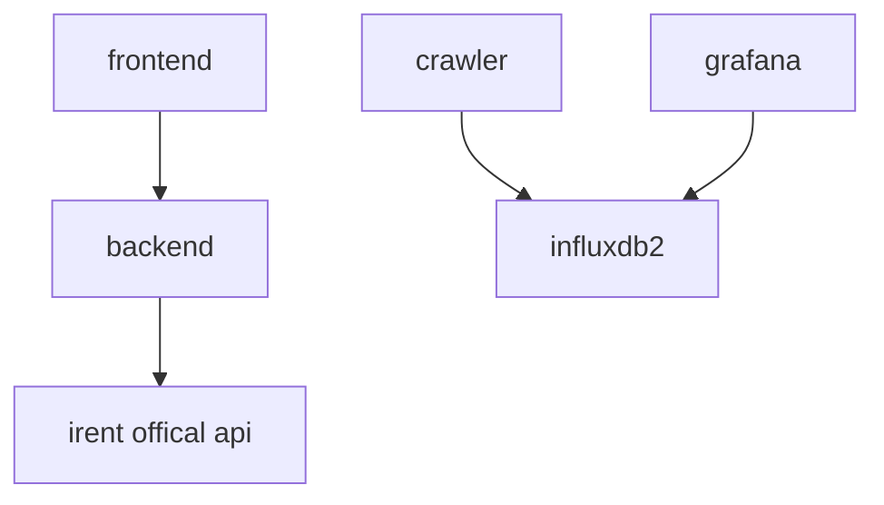

# IRent app

[IRent app](https://irent.seancheng.space) 此平台為本人對於[IRent](https://www.easyrent.com.tw/irent/web/index.html)
UI/UX
優化整合出來的系統，並不會儲存任何個人和機密資訊。並且做了[車輛分析](https://gfn.seancheng.space/d/_lM1IlXnz/irent?orgId=1&refresh=30s&from=now-2d&to=now)

## Introduction

[IRent](https://www.easyrent.com.tw/irent/web/index.html) 提供了共享汽機車的服務。對使用者來說，減少了養車所需的費用；對整個環境來說，
也減少了車輛的總數，進而達到環保的目的，是個目的很好的一個服務。但是在產品 UI/UX 的設計上，我本人以使用者的角度，對於該服務進行了一些優化。

## Features

### Guests

- 根據使用者的地理位置找到最近的 n 台車並且顯示車輛資訊。
- 使用 IRent 的帳號密碼登入此平台。
- 查看車輛分析儀表板。
    - 即時空車率。
    - 48小時空車率曲線圖。
    - 空車車輛以區域為群組顯示前10名列表。

### Members

- 顯示會員未繳費用，因為有欠款不能租車。
- 直接在可用車輛上租車並顯示預約列表。
- 取消預約車輛。

## Q&A

### APP 一直需要重新登入

因為 IRent 本身登入機制設計問題，同時只能存在一個有效token，所以造成後踢前的問題。如果有在此平台登入，需要重新登入 APP
屬於正常現象。

### 預約完，如何開始使用車輛

此平台目前沒有實作開始租車流程，所以開始租車還是需要在 APP 裡執行。

## Architecture

### Domain Diagram

### Overview

